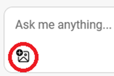

[Zurück zum Index](https://microsoftlearning.github.io/MS-4012-Microsoft-Copilot-Web-Based-Interactive-Experience-for-Executives/)

# Microsoft Copilot (Webbereich)

## Copilot und große Sprachmodelle

### Gesprächsthemen

Microsoft Copilot im Web bietet Ihnen einen KI-unterstützten persönlichen Assistenten, der Fragen beantworten und bei allgemeinen Aufgaben helfen kann. Ich kann ihm Fragen stellen und er wird mir Antworten geben, die denen einer Person mit höherer Bildung ähneln.

Wenn Sie oder Ihre Organisation Copilot mit kommerziellem Datenschutz verwenden, wird Ihr Chat nicht gespeichert. Alle Daten werden verschlüsselt und Microsoft speichert keine Ihrer Prompts oder Antworten. Sie werden nicht für das Training des Modells verwendet, sodass Sie sicher sein können, dass Ihre persönlichen und organisatorischen Informationen vertraulich behandelt werden.

Ich kann zum Beispiel eine allgemeine Wissensfrage wie diese stellen und erhalte viele großartige Informationen. Sie können sich das als ein grundlegendes konzeptionelles Modell der Welt vorstellen, das verwendet wird, um Fragen zu beantworten.

**Beispiel:**
- **Prompt:** Was kannst du mir über Elefanten erzählen?
- **Antwort:** (Besprechen der Antwort)

Copilot verwendet große Sprachmodelle (LLMs), die mit riesigen Informationsmengen trainiert wurden, darunter Bing-Suchen und -Ergebnisse. Aber Copilot ist nicht nur ein Faktenprüfer. Wir können Copilot als allgemeine Schlussfolgerungsmaschine verwenden, die Ihre Fragen aufnimmt und stochastisch durchdenkt. In der Branche nennen wir dies „Rückschluss“.

**Beispiel:**
- **Prompt:** Mich interessiert eher die Kraft eines Elefanten. Wie viele Menschen braucht man, um beim Tauziehen gegen einen Elefanten zu gewinnen? HINWEIS: Denken Sie an die Region und Ihr Publikum, da nicht jeder den Begriff „Tauziehen“ kennt, sodass Sie ihn möglicherweise entsprechend anpassen müssen. 
- **Antwort:** (Besprechen der Antwort)

Copilot konnte Vermutungen anstellen und Verbindungen zwischen Wissenselementen herstellen, um mir eine differenziertere Antwort auf meine Frage zu geben. Während wir Copilot verbessern, erfahren wir viel darüber, worin diese LLMs gut sind und worin nicht, und wir bauen dieses Wissen in das Produkt ein, während wir es entwickeln.

### Demoschritte

> **HINWEIS:** Wenn Sie Ihre eigenen Prompts verwenden möchten, beginnen Sie mit einem Thema aus dem Bereich Allgemeinwissen, das für Sie oder Ihre Kundinnen und Kunden interessant ist.

1. Wechseln Sie zur Registerkarte „Edge“, während Copilot geöffnet und der Webbereich ausgewählt ist.

    

1. Kopieren Sie den Prompt aus den Prompt-Bibliotheksdokumenten in das Textfeld **Ask me anything...** und fügen Sie ihn ein oder geben Sie Folgendes ein:

    ```text
    What can you tell me about elephants?
    ```
1. Klicken Sie auf die Schaltfläche **Übermitteln**.
1. Kopieren Sie den Prompt in das Textfeld **Ask me anything...** und fügen Sie ihn ein:

    ```text
    I’m more interested in the power of an elephant. How many humans would it take to win a tug-of-war with an elephant?
    ```
1. Klicken Sie auf die Schaltfläche **Übermitteln**.

## Grounding

### Gesprächsthemen

Was diese Leistung jedoch auf die nächste Stufe hebt, ist die Fähigkeit, Copilot mit externen Daten und externem Wissen zu verankern. Manchmal wird dies als Retrieval Augmented Generation (RAG) bezeichnet. Dies ist der Prozess der Bereitstellung zusätzlicher Informationen für das jeweilige Sprachmodell, das für die jeweilige Aufgabe relevant ist.

Wir können unsere Fragen auf alle Arten von Daten und Dokumenten stützen, zum Beispiel auf den Stellenbericht des Bureau of Labor Statistics. Dies ist ein riesiges Dokument, das jährlich veröffentlicht wird und voller Daten über Arbeitsplätze und Beschäftigungstrends in den USA ist. Copilot ist in der Lage, diese Informationen zu finden, sie zu verstehen und mir eine Antwort auf meine Frage in Echtzeit zu geben. Außerdem enthält sie Referenzen, die darstellen, woher Copilot diese Informationen erhalten hat, z. B. von der Website des Bureau of Labor Statistics. Das bedeutet, dass ich überprüfen kann, woher Copilot seine Informationen hat, und mehr Kontext erhalten kann, denn es handelt sich um Copilot, nicht um Autopilot.

### Demoschritte

1. Klicken Sie auf **New Topic**, um ein neues Thema zu beginnen.

    

1. Kopieren Sie den Prompt in das Textfeld **Ask me anything...** und fügen Sie ihn ein:

    ```text
    Can you give me a list of the labor force participation rates from the Bureau of Labor Statistics over the last 5 years?
    ```
1. Klicken Sie auf die Schaltfläche **Übermitteln**.
1. In der Antwort, neben **Learn more** fahren Sie mit der Maus über eine oder zwei der Referenzen.

## Weitere Copilot Skills

### Gesprächsthemen

Das ist großartig, aber ich würde wirklich gerne eine grafische Darstellung dieser Daten sehen. Leider kann Copilot im Moment kein Diagramm zeichnen, aber das bedeutet nicht, dass wir nicht weiterkommen. Während wir Copilot entwickeln, fügen wir verschiedene Fähigkeiten hinzu. Fähigkeiten sind Möglichkeiten, wie Copilot seine Denkfähigkeit einsetzen kann, um Probleme zu lösen.

Eine weitere Fähigkeit, über die Copilot verfügt, ist die Fähigkeit zu programmieren. Ich werde Copilot daran erinnern, dass er weiß, wie man programmiert, und weitere Informationen finden, ob ich ihn dazu bringen kann, den Python-Code für das gewünschte Diagramm zu schreiben.

**Beispiel:**
- **Prompt:** Kannst du mir eine Liste der Erwerbsquoten des Bureau of Labor Statistics der letzten 5 Jahre geben? Ich habe auch gehört, dass du programmieren kannst. Kannst du die Daten von bls.gov abrufen und dann den Python-Code schreiben, der das von mir gesuchte Diagramm erstellt?
- **Antwort:** (Besprechen der Antwort)

Wir gehen davon aus, dass diese Art von Prozessen mit der Zeit einfacher und automatisierter werden.

### Demoschritte

1. Klicken Sie auf **New Topic**, um ein neues Thema zu beginnen.

    

1. Kopieren Sie den Prompt in das Textfeld **Ask me anything...** und fügen Sie ihn ein:

    ```text
    Can you give me a list of the labor force participation rates from the Bureau of Labor Statistics over the last 5 years? I also heard that you could code. Can you grab the data from bls.gov and then write the Python code that would produce the graph I'm looking for?
    ```

1. Klicken Sie auf die Schaltfläche **Übermitteln**.

## Optionale Demoschritte

### Erkennen von Bildern

Laden Sie zunächst Folgendes herunter: [**What is this image.png**](https://github.com/MicrosoftLearning/MS-4012-Microsoft-Copilot-Unlocked/raw/master/Resourcefiles/what_is_this_image.PNG)

1. Klicken Sie auf **New Topic**, um ein neues Thema zu beginnen.

    

1. Wählen Sie unten auf der Seite das Symbol **Add an image** (Bild hinzufügen) aus.

    

1. Wählen Sie **Upload from this device**.
1. Navigieren Sie zu dem Speicherort, an dem Sie das Bild heruntergeladen haben, wählen Sie **What is this picture.png** und wählen Sie dann **Open** aus.
1. Im Textfeld **Ask me anything...** geben Sie den folgenden Prompt ein:

    ```text
    What is this picture?
    ```

1. Klicken Sie auf die Schaltfläche **Übermitteln**.

### Darstellen, wie Copilot Bilder erstellen kann

1. Kopieren Sie den Prompt in das Textfeld **Ask me anything...** und fügen Sie ihn ein:

    ```text
    Copilot, make a banner for a hamburger stand. Make it friendly and show people enjoying a hamburger.
    ```

1. Klicken Sie auf die Schaltfläche **Übermitteln**.

### Darstellen, wie Copilot einen Song schreiben kann

1. Wechseln Sie zu einer neuen Browsersitzung, bei der Sie bei einem persönlichen Konto angemeldet sind.

> **HINWEIS:** Sie müssen für diesen Schritt ein persönliches Konto verwenden. Geschäftskonten funktionieren nicht.

1. Wählen Sie oben rechts **Plug-Ins** aus.

    

1. Aktivieren Sie in der Liste der verfügbaren Plug-Ins **Suno**.

    

    > **HINWEIS:** Um Suno zu verwenden, müssen Sie ein neues Thema in Copilot starten und dann Suno aktivieren.

1. Kopieren Sie den Prompt in das Textfeld **Ask me anything...** und fügen Sie ihn ein:

    ```text
    Write a country song about Microsoft Copilot, extolling its virtues as an AI companion. Make it catchy, upbeat, and a little quirky.
    ```

1. Klicken Sie auf die Schaltfläche **Übermitteln**.

[Zurück zum Index](https://microsoftlearning.github.io/MS-4012-Microsoft-Copilot-Web-Based-Interactive-Experience-for-Executives/)
