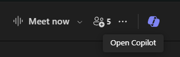
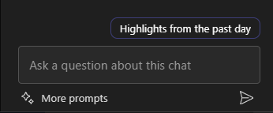

---
demo:
  title: 'Demo: Copilot in Teams'
---

[Zurück zum Index](https://microsoftlearning.github.io/MS-4012-Microsoft-Copilot-Web-Based-Interactive-Experience-for-Executives/)

# Copilot in Teams

## Demoeinrichtung

Um eine reibungslose Demo sicherzustellen, wählen Sie eine der folgenden Setupoptionen aus:

**Option A: Besprechungszusammenfassung**

Die Anweisungen zur Einrichtung der Demo-Version für diese Option finden Sie [hier](https://microsoft.seismic.com/Link/Content/DCFPQWmT2DMXC8WJjgjP4H44GWXG). Sehen Sie sich insbesondere die Seiten 5 bis 10 an, auf denen beschrieben wird, wie Sie die Teamsbesprechung (Projekt Avalon) einrichten, auf die wir in der folgenden Demo verweisen werden.

> **WICHTIG:**
> - Das Demo-Setup für Option A erfordert mindestens 4 Personen (optional 6).
> - Führen Sie dies mit Ihrem Team vor der geplanten Bereitstellung durch.
> - Nach Abschluss können Sie auf diese Teamsbesprechung für zukünftige Bereitstellungen verweisen.
> - Wenn Sie aus irgendeinem Grund nicht in der Lage sind, die Vorbereitungsarbeit zu erledigen, sehen Sie sich die Demo zu Option B an.

**Option B: Teams-Chat**

Diese Demooption ist absichtlich nicht voreingestellt. Sie müssen jedoch einen Ihrer eigenen bereits vorhandenen Teams-Chatthreads nutzen. Stellen Sie sicher, dass in diesem Chat keine vertraulichen Informationen ausgetauscht werden, bevor Sie ihn für Ihre Demo verwenden.


## Option A: Besprechungszusammenfassungs-Demo

### Gesprächsthemen

„Jetzt werde ich Ihnen zeigen, was wir in Teams als Besprechungszusammenfassung bezeichnen.

Hier ist eine Besprechung zwischen mir und meinem Teammitglied. Aus Gründen der Vertraulichkeit können wir Ihnen unsere echte Besprechung nicht wirklich darstellen, aber hier ist eine fiktive Besprechung, die ich mit meinem Team aufgezeichnet habe und in der wir über die Einführung eines fiktiven Produkts namens „Project Avalon“ sprechen.

Die Zusammenfassung basiert auf der Aufzeichnungstranskription. Es stellt dar, wer beteiligt war und wann die Gespräche stattgefunden haben. Es gibt auch eine Zusammenfassung dessen, wovon wir gesprochen haben. Copilot hat meine Besprechung in Abschnitte unterteilt, damit ich leichter finde, wonach ich suche.

Jetzt kann ich Copilot Fragen stellen und mehr Informationen über dieses Treffen erhalten. Sehen wir uns zum Beispiel an, was besprochen wurde und welche Aktionselemente für jede Person vorliegen.

### Demoschritte

1. Wechseln Sie zur Registerkarte des Browsers, in dem Microsoft Teams für die Besprechung **Project Avalon launch meeting** geöffnet ist.

    > **WICHTIG:**  Zeigen Sie keine Besprechungen oder Chats an, die vertrauliche Daten enthalten.

1. Wählen Sie die Registerkarte **Recap**.

    

1. Verweisen sie auf die **Speaker**.
1. Wählen Sie **Themen** aus.

    

1. Wählen Sie **Chapters**.

    

1. Wählen Sie in der oberen rechten Ecke **Copilot** aus.

    

1. Kopieren Sie den Prompt in das Textfeld **Ask me anything about this meeting** und fügen Sie ihn ein:

    ```text
    Can you list action items and owners in a table?
    ```

1. Wählen Sie **Send** (Senden) aus.
1. Kopieren Sie den Prompt in das Textfeld **Ask me anything about this meeting** und fügen Sie ihn ein: 

    ```text
    Did anyone strongly oppose the decision, and how do you know?
    ```
    
1. Wählen Sie **Send** (Senden) aus.
1. Kopieren Sie den Prompt in das Textfeld **Ask me anything about this meeting** und fügen Sie ihn ein:

    ```text
    Based on the transcript, when would you recommend we launch the product and why?
    ```

1. Wählen Sie **Send** (Senden) aus.

## Option B: Teams-Chat

### Gesprächsthemen

„Jetzt werde ich Ihnen darstellen, wie Copilot unsere Teams Chat-Erfahrung verbessern kann.

Hier ist ein Chatthread zwischen mir und meinen Teammitgliedern. Copilot hilft Ihnen dabei, indem er die Höhepunkte unseres Chats zusammenfasst. So können Sie sich über wichtige Punkte informieren, ohne sich jede Nachricht durchlesen zu müssen.

Jetzt kann ich Copilot Fragen stellen, um spezifischere Informationen aus dem Chat zu erhalten. Lassen Sie uns beispielsweise herausfinden, was die geöffneten Elemente sind und wie wir mit den nächsten Schritten fortfahren sollten.

Darüber hinaus kann ich eine Antwort entwerfen und Copilot verwenden, um sie zu verfeinern, um sicherzustellen, dass meine Botschaft klar und prägnant ist. Dies ist besonders nützlich, um eine effektive Kommunikation innerhalb des Teams zu gewährleisten.“

### Demoschritte

1. Suchen Sie einen Teams-Chatthread, in dem Sie keine vertraulichen Informationen ausgetauscht haben. Wählen Sie die Option **Open chat in a new window**.

    

1. Wählen Sie im Teams-Chat, der sich in einem neuen Fenster geöffnet hat, die Option **Open Copilot** oben rechts aus.

    

1. Wählen Sie im sich öffnenden Copilot-Chatfenster **Highlights from the past day*** aus, um eine kurze Zusammenfassung der Chats des vergangenen Tages zu erhalten.

    

1. Kopieren Sie den Prompt in das Textfeld **Ask a question about this chat** und fügen Sie ihn ein: 

    ```text
    What are the open items?
    ```
    > **Hinweis:** Sie können gerne ein alternatives Prompt-Beispiel wählen, von dem Sie glauben, dass es Ihre Zielgruppe besser anspricht.   

1. Geben Sie unter dem Chatverlauf in das Textfeld **Type a message** eine Antwort ein. **Klicken Sie noch nicht auf die Senden-Schaltfläche.**

1. Wählen Sie in Ihrem Antwortentwurf „Copilot“ aus dem Textfeld **Type a message** aus.

       

1. Experimentieren Sie mit den Copilot-Optionen **Rewrite** und **Adjust**, um die Fähigkeiten von Copilot weiter zu demonstrieren.

         

[Zurück zum Index](https://microsoftlearning.github.io/MS-4012-Microsoft-Copilot-Web-Based-Interactive-Experience-for-Executives/)
